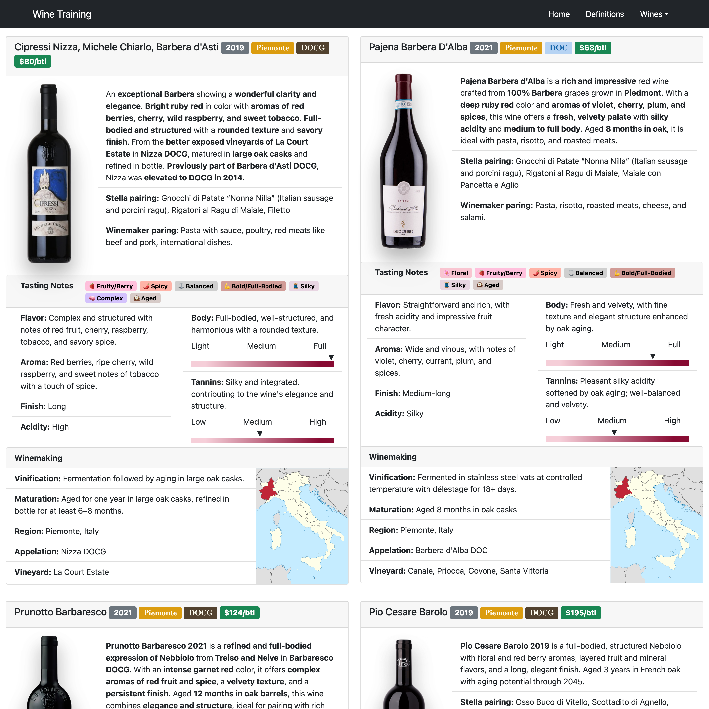

# Wine Training
   
## Description

A website that:
* Helps train new staff members with specifications
* Interactive with React scripts

## Credits
[ Daniel Vasquez Talavera](https://github.com/DVasquez4155)
## Contributing
This project has adopted the code of conduct defined by [Contributor Covenant](https://www.contributor-covenant.org/version/2/0/code_of_conduct/).
## License
Licensed under the [MIT License](https://choosealicense.com/licenses/mit/) lic
